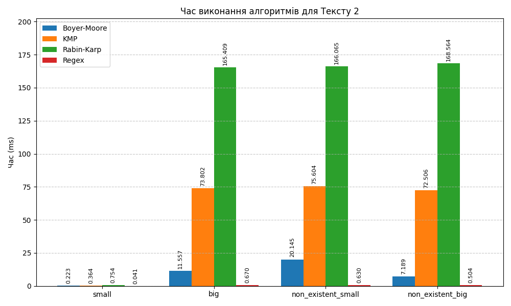

# goit-algo-hw-05

## Зміст

- [goit-algo-hw-05](#goit-algo-hw-05)
  - [Зміст](#зміст)
  - [Завдання 3: Порівняння ефективності алгоритмів пошуку підрядка](#завдання-3-порівняння-ефективності-алгоритмів-пошуку-підрядка)
    - [Методологія тестування](#методологія-тестування)
    - [Результати тестування](#результати-тестування)
      - [**Текст 1 ("стаття 1.txt")**](#текст-1-стаття-1txt)
      - [**Текст 2 ("стаття 2.txt")**](#текст-2-стаття-2txt)
    - [Висновки](#висновки)
      - [Ефективність для "стаття 1.txt"](#ефективність-для-стаття-1txt)
      - [Ефективність для "стаття 2.txt"](#ефективність-для-стаття-2txt)
      - [Загальний висновок](#загальний-висновок)

## Завдання 3: Порівняння ефективності алгоритмів пошуку підрядка

У цьому завданні було проведено порівняння трьох алгоритмів пошуку підрядка: Боєра-Мура, Кнута-Морріса-Пратта (KMP) та Рабіна-Карпа. Також для ілюстрації різниці у швидкодії було протестовано вбудований пошук (Regex).

### Методологія тестування

Тестування проводилося на двох текстових файлах:

1. **"стаття 1.txt"**
2. **"стаття 2.txt"**

Для кожного алгоритму та кожного тексту було проведено вимірювання часу пошуку чотирьох типів підрядків:

- **Існуючий (small)**: короткий підрядок, що знаходиться на початку або в середині тексту.
- **Існуючий (big)**: довгий підрядок (речення), що знаходиться в кінці тексту.
- **Неіснуючий (small)**: коротке слово, якого немає в тексті.
- **Неіснуючий (big)**: довге речення, якого немає в тексті.

Для отримання статистично значущих результатів кожен тест виконувався **100 разів** за допомогою бібліотеки `timeit`.

### Результати тестування

Вказано загальний час виконання в мілісекундах (ms) для 100 повторів (не середній час).

#### **Текст 1 ("стаття 1.txt")**

| Тип підрядка | Boyer-Moore | KMP | Rabin-Karp | Regex |
| :--- | :--- | :--- | :--- | :--- |
| **small** | 0.512 | 1.277 | 2.864 | 0.065 |
| **big** | 5.121 | 43.367 | 96.777 | 0.341 |
| **non_existent_small** | 27.517 | 52.086 | 115.522 | 0.443 |
| **non_existent_big** | 4.524 | 51.015 | 117.862 | 0.369 |

#### **Текст 2 ("стаття 2.txt")**

| Тип підрядка | Boyer-Moore | KMP | Rabin-Karp | Regex |
| :--- | :--- | :--- | :--- | :--- |
| **small** | 0.223 | 0.364 | 0.754 | 0.041 |
| **big** | 11.557 | 73.802 | 165.409 | 0.670 |
| **non_existent_small** | 20.145 | 75.604 | 166.065 | 0.630 |
| **non_existent_big** | 7.189 | 72.506 | 168.564 | 0.504 |

### Висновки

#### Ефективність для "стаття 1.txt"

- **Найшвидший**: **Боєра-Мура** показав найкращі результати у всіх категоріях серед імплементованих алгоритмів.
- **Найповільніший**: Рабіна-Карпа, особливо на довгих підрядках та при пошуку неіснуючих елементів, де час виконання перевищував 1 мс.
- Алгоритм Боєра-Мура виявився приблизно в 8-10 разів швидшим за KMP на довгих підрядках.

#### Ефективність для "стаття 2.txt"

- **Найшвидший**: **Боєра-Мура** також переміг у всіх категоріях.
- **Найповільніший**: Рабіна-Карпа.
- Різниця в швидкості збереглася: Боєра-Мура залишається значно ефективнішим, особливо при обробці великих текстів або складних патернів.

#### Загальний висновок

За результатами тестування на обох текстах можна впевнено стверджувати:

1. **Алгоритм Боєра-Мура є найефективнішим** серед розглянутих класичних алгоритмів для задачі пошуку підрядка в тексті.
2. **Алгоритм Кнута-Морріса-Пратта (KMP)** є стабільним "срібним призером", працюючи швидше за Рабіна-Карпа, але поступаючись Боєра-Мура.
3. **Алгоритм Рабіна-Карпа** виявився найменш ефективним для цієї конкретної задачі (пошук одного підрядка).
4. Вбудовані засоби Python (модуль `re`) працюють на порядок швидше за будь-яку чисту Python-реалізацію, тому в реальних проектах слід надавати перевагу саме їм.
